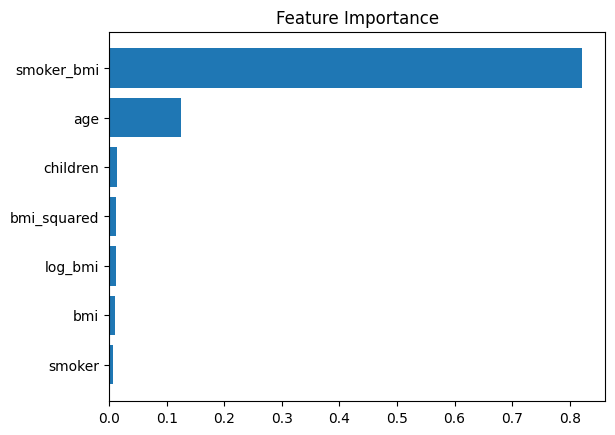
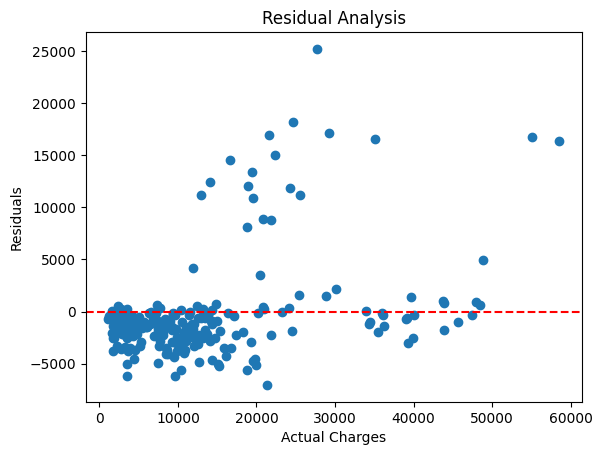
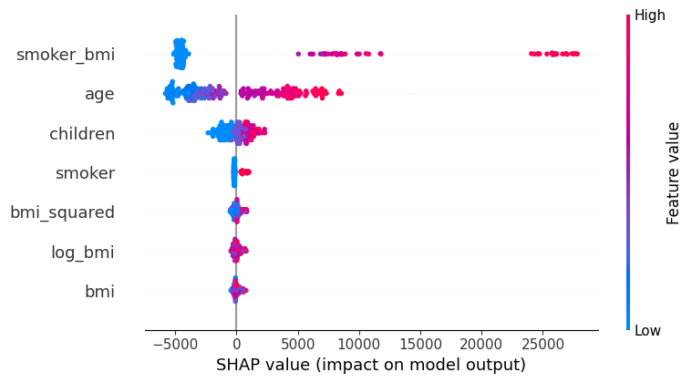

# Insurance Charge Prediction Model

This project implements a machine learning model to predict health insurance charges based on customer information. The model uses various regression techniques and feature engineering to achieve optimal predictions.

## Dataset Description

The project uses the `insurance.csv` dataset with the following features:

| Column    | Data Type | Description                                                    |
|-----------|-----------|----------------------------------------------------------------|
| `age`     | int       | Age of the beneficiary                                         |
| `gender`  | object    | Male or female                                                 |
| `bmi`     | float     | Body mass index (height/weight indicator)                      |
| `children`| int       | Number of children                                             |
| `smoker`  | object    | Smoking status (yes/no)                                        |
| `region`  | object    | US residential area (four regions)                             |
| `charges` | float     | Individual medical costs billed by health insurance            |

## Model Development Process

1. **Initial Model Comparison**
   - Tested four different regression models:
     - Linear Regression
     - Decision Tree Regressor
     - Random Forest Regressor
     - XGBoost Regressor
   - Random Forest showed the best performance

2. **Feature Selection**
   - Used permutation importance to identify key features
   - Removed less important features:
     - region_northeast
     - region_northwest
     - region_southwest
     - is_male



3. **Model Optimization**
   - Performed GridSearchCV to find optimal Random Forest parameters
   - Best parameters:
     - n_estimators: 300
     - max_depth: None
     - min_samples_split: 10
     - min_samples_leaf: 4

4. **Feature Engineering**
   Added new features to improve model performance:
   - smoker_bmi: Interaction between smoking status and BMI
   - bmi_squared: Square of BMI
   - log_bmi: Natural logarithm of BMI

5. **Model Validation**
   - Used cross-validation (5-fold)
   - Performed residual analysis
   - Implemented SHAP values for model interpretability



## Required Libraries
```python
pandas
numpy
seaborn
matplotlib
scikit-learn
xgboost
shap
```

## Usage

1. Load and prepare the data:
```python
df = pd.read_csv('insurance_p1.csv')
```

2. Drop unnecessary features and add engineered features:
```python
X = df.drop(columns=['charges', "region_northeast", "region_northwest", 
                     "region_southwest", "is_male"])
X['smoker_bmi'] = X['smoker'] * X['bmi']
X['bmi_squared'] = X['bmi'] ** 2
X['log_bmi'] = np.log(X['bmi'])
```

3. Train the optimized model:
```python
model = RandomForestRegressor(
    n_estimators=300,
    max_depth=None,
    min_samples_split=10,
    min_samples_leaf=4,
    random_state=42
)
model.fit(X_train, y_train)
```

4. Make predictions:
```python
predictions = model.predict(X_test)
```

## Model Performance

The optimized Random Forest model achieves:
- Cross-validated R²: Reported in cross_val_score
- Feature importance analysis available through SHAP values
- Residual analysis shows model performance across different charge levels



## Validation

The model can be validated on new data using the provided validation dataset:
```python
val_df = pd.read_csv('validation_dataset_insurance_p1.csv')
predictions = model.predict(val_df)
```

<div>
<table border="1" class="dataframe">
  <thead>
    <tr style="text-align: right;">
      <th></th>
      <th>age</th>
      <th>bmi</th>
      <th>children</th>
      <th>smoker</th>
      <th>smoker_bmi</th>
      <th>bmi_squared</th>
      <th>log_bmi</th>
      <th>predicted_charges</th>
    </tr>
  </thead>
  <tbody>
    <tr>
      <th>0</th>
      <td>18.0</td>
      <td>24.090000</td>
      <td>1.0</td>
      <td>0</td>
      <td>0.000000</td>
      <td>580.328100</td>
      <td>3.181797</td>
      <td>3110.337564</td>
    </tr>
    <tr>
      <th>1</th>
      <td>39.0</td>
      <td>26.410000</td>
      <td>0.0</td>
      <td>1</td>
      <td>26.410000</td>
      <td>697.488100</td>
      <td>3.273743</td>
      <td>20245.083142</td>
    </tr>
    <tr>
      <th>2</th>
      <td>27.0</td>
      <td>29.150000</td>
      <td>0.0</td>
      <td>1</td>
      <td>29.150000</td>
      <td>849.722500</td>
      <td>3.372455</td>
      <td>20201.979828</td>
    </tr>
    <tr>
      <th>3</th>
      <td>71.0</td>
      <td>65.502135</td>
      <td>13.0</td>
      <td>1</td>
      <td>65.502135</td>
      <td>4290.529728</td>
      <td>4.182083</td>
      <td>49718.991133</td>
    </tr>
    <tr>
      <th>4</th>
      <td>28.0</td>
      <td>38.060000</td>
      <td>0.0</td>
      <td>0</td>
      <td>0.000000</td>
      <td>1448.563600</td>
      <td>3.639164</td>
      <td>6327.541481</td>
    </tr>
  </tbody>
</table>
</div>